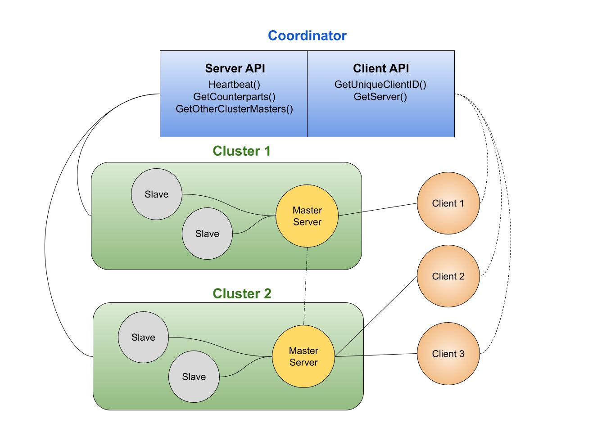

## Distributed Social Network Service
A highy available, fault tolerant, and scalable distributed social network service with a central coordinator written with C++ and gRPC.



### Overview
The system consists of three parts: A central coordinator, servers, and clients. Clients initially make a request to the coordinator to obtain the address of the master server which will serve the client requests. Upon reciept of any client request, cluster masters propogate the request to each of their slaves and to other cluster masters (which propogate the request to their own slave servers) to ensure that the data is replicated across each server. If a master dies, a slave within the same cluster will take over the role of master and begin serving requests to the client. If there are no servers available to serve client requests in its assigned cluster, the coordinator searches for the first available cluster and assigns it to the client. The infrastructure is highly scable as it can handle an arbitrary number of clusters and servers in each cluster. All communication between the servers and coordinators is logged with the glog library. 

#### Coordinator

The coordinator maintains a file lock service and server metadata in memory. It provides the infrastructure for cross-server communication and fault tolerance, and serves as the broker for communication between clients and servers.

`Heartbeat()`
The main point of contact between the coordinator and servers is the Heartbeat RPC. Servers send an initial heartbeat on startup to register themselves with the coordinator, and then periodically send heartbeats to inform the coordinator that they are still active.

_Initial Heartbeat_
When a server sends an initial heartbeat, the coordinator creates an entry for the server in the specified cluster and stores its metadata (server address, etc.). The server tries to acquire the master file lock, and if it fails, it acquires a slave file lock. Servers write their address in their acquired files. If a server is a slave, the address of its cluster master is returned. If it's a master, the address of a another cluster master is returned if available. Servers then use the returned address to synchronize themselves with the current data.

Each subsequent heartbeat also serves as a leader election. If the server is already a master, it remains the master. If the server is a slave, it attempts to acquire the master file lock. If it succeeds, it becomes the new cluster master.

`checkHeartbeats()`
The check heartbeats method runs in a separate thread and checks to if any servers have missed their heartbeats. Servers that miss 2 heartbeats are considered inactive and their file locks are released. 

> The coordinator uses FSMemory as its in-memory filesystem. I initially used a map of strings as a makeshift filesystem, but I became interested in writing a proper  tree-based data structure to represent an in-memory filesystem with a UNIX-like API. This project includes a `test` directory which implements a simple shell for testing and interacting with FSMemory. After building the project, the test executable can be found in `build/bin`. The source code for FSMemory can be found in the FSWrapper folder, which also includes a FSLocal class which serves as a useful wrapper around various filesystem operations and is used in my server implementation.

The coordinator also provides the `GetCounterparts` and `GetOtherClusterMasters` RPCs which are used by master servers for data replication across slaves and other cluster masters.

_Client Communication_
Lastly, the coordinator provides the `GetUniqueClientID` RPC which generates a client ID. Clients use their IDs with the `GetServer` RPC to refresh the server address at which they send requests in case the cluster master changes. As mentioned earlier, if there are no servers available to serve client requests in its assigned cluster, the coordinator searches for the first available cluster and assigns it to the client.

#### Server
On startup, a server sends a heartbeat to the coordinator and receives a sync address which it contacts to synchronize itself. If the sync address is empty, the server is a cluster master with no other clusters available, and it tries to initialize with local data if available. Servers periodically send heartbeats to the coordinator to let it know that they are still available, and to try to acquire the master file lock if they are not the master. 

The servers implement the core functionality of the social network service. Clients can login, follow other users, unfollow other users, list all available users and their own follower/following status, and enter the timeline, or chat mode, in which they can make posts that are sent to their followers. 

Each request is logged in a local userinfo file:
```
/*
    Format:
    user <username>
    follow <user1> <user2> <timestamp>
    unfollow <user1> <user2>
*/
```

and each post is logged in a posts file
```
/*
    T <timestamp>
    U <username>
    W <post content>
    <newline>
*/
```

If a server is a cluster, it propogates all requests to all of its available slaves, and to all other cluster masters (which then propogate the data to their slaves).

#### Client
The client code provides a bash for the user to send requests with. Clients periodically send `GetServer()` requests to the coordinator to get the address of the current server which will serve its requests. If no servers are available, the refresh request is retried 3 times before the client exits.  

### Running the System
This project uses cmake to build the executables. In order to build the system, you must ensure that you have the gRPC and glog libraries installed on your machines. 

To build the project, run the following commands
```
mkdir build
cd build
cmake ..
make
```

The executables will be built and placed in `build/bin`. There are three running scripts provided in the top level directory: `client.sh`, `coord.sh`, and `server.sh`. These simply run the executables placed in `build/bin` and set the log output to stderr instead of a `tmp` directory. You can ass the arguments you'd pass to the raw executables to these scripts.

#### Run Coordinator
```
./coord.sh -n <num clusters> -h <ip> -p <port number>
```

By default, the coordinator runs on `localhost:9000` with3 clusters.

#### Run Server
```
./server.sh -c <cluster id> -s <server id> -h <coord ip> -k <coord port> -i <server ip> -p <server port>
```

The cluster id must be [1, numClusters]
Default values:
```
c: 1
s: 1
h: localhost
k: 9000
i: localhost
p: 10000  
```

#### Run Client
```
./client.sh -h <coord ip> -k <coord port> -u <username>
```
By default, connects to coordinator at `localhost:9000`

<hr>

#### Issues, Limitations, and Future Work
- On the client side, once you enter the chat, there is no way to leave it. Need to close the stream on recipt of a `exit` command and return to the regular client bash. However, if a client reconnects to a different server, sending a post will fail, and the client will return to the regular bash.
- Ideally, the client would receive a constant virtual IP address and its requests would be handled and redirected by a virtual IP server.
